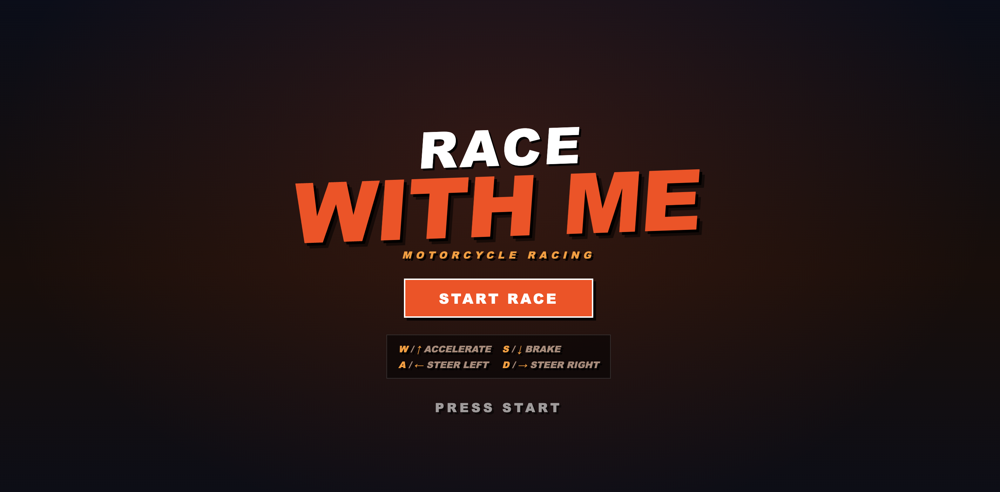
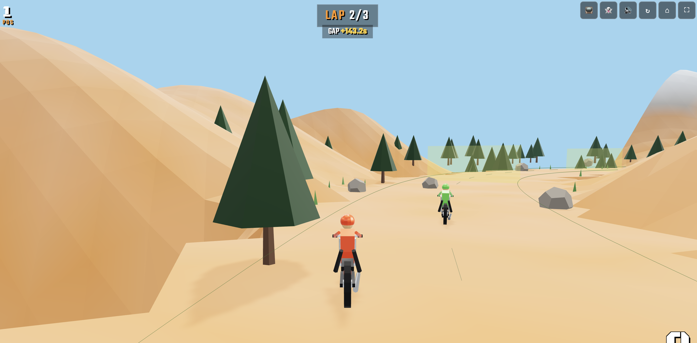

# Race With Me

Browser-based 3D bike racing game — single-player vs 4 AI bots across a jungle terrain track. Built with Three.js.

<p align="center">
  
  
</p>

## Play

- **Online**: [shreyashp47.github.io/raceWithMe](https://shreyashp47.github.io/raceWithMe/)
- **Locally**:
  ```
  npm install
  npm run dev
  ```
  Open `http://localhost:5173` in your browser.

## How to Play

Race 3 laps around an alpine track against 4 AI bots. Ride over the dirt ramps to catch air — land cleanly to keep speed, crash if you land too hard. Off-road sections are slower but can be used as shortcuts.

## Controls

| Key | Action |
|-----|--------|
| W / ↑ | Accelerate |
| S / ↓ | Brake / Reverse |
| A / ← | Steer Left |
| D / → | Steer Right |
| Esc | Return to menu |

**Jumping**: Ride over ramp sections on the track at speed — launch is automatic. Nose dips while falling; landing angle and speed determine if you land cleanly or crash.

Mobile touch controls auto-appear on touch devices.

## Top Bar

| Button | Action |
|--------|--------|
| 📺 | Toggle CRT scanline filter |
| 👻 | Toggle ghost replay (best run) |
| 🔊 | Toggle audio |
| ↻ | Restart race |
| ⌂ | Return to menu |
| ⛶ | Toggle fullscreen |

## Dev Tools

```
npm run bike     # Standalone bike viewer with orbit controls
npm run track    # Standalone track viewer with orbit controls
```

## Features

- **Track**: Winding closed-loop road (CatmullRom spline, 12 control points) with dashed center line, dirt surface, green edge lines
- **Terrain**: Procedural elevation with hills/mountains; off-track areas reduce traction
- **Bike**: Low-poly sport bike with rider, helmet, dual headlights, spoke wheels; third-person chase camera
- **AI**: 4 bots with 4 difficulty tiers, follow track spline, react to terrain height
- **Laps**: 12 checkpoints, 3 laps, finish detection
- **HUD**: Speed (KM/H), position, lap counter, live gap to next rider, overtake notifications
- **Countdown**: 3-2-1-GO with animated pop
- **Results**: Graded rank (F to A+) with position, top speed, restart/home buttons
- **Ghost**: Records best run to localStorage, plays as cyan transparent bike
- **Photo Finish**: Freeze frame on close races (<0.5s)
- **CRT Filter**: Scanlines + vignette overlay toggle

## Tech Stack

- [Three.js](https://threejs.org/) (r185) — 3D rendering
- [Vite](https://vitejs.dev/) — Build tool / dev server
- JavaScript (ES modules), no TypeScript

## Build

```
npm run build    # Outputs to dist/
npm run preview  # Preview production build
```

Deployed via GitHub Actions to GitHub Pages.
